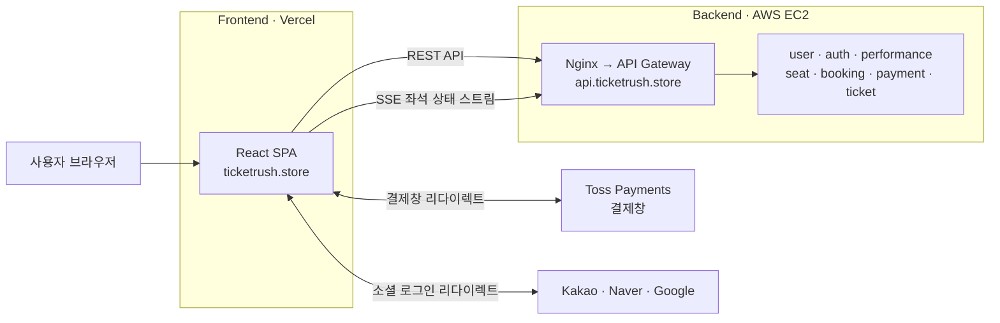
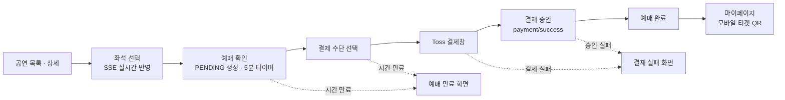
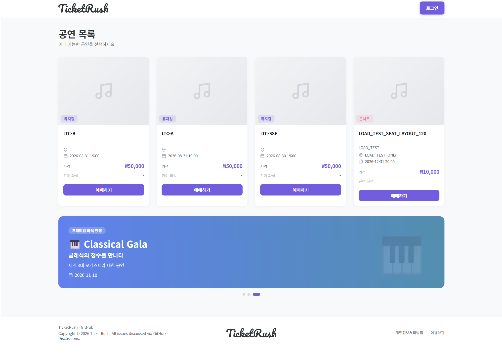
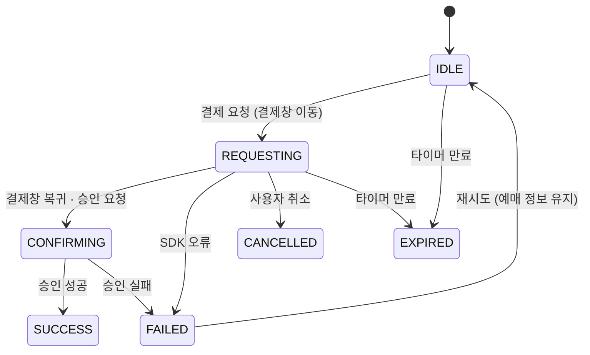
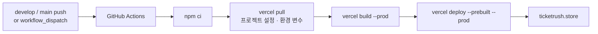

# 🎫 TicketRush Frontend - 대규모 트래픽을 처리하는 MSA 기반 공연 티켓 예매 플랫폼

> TicketRush의 **사용자 예매 웹**과 **관리자 콘솔**을 담당하는 React + TypeScript 프론트엔드 레포지토리입니다.

[](https://github.com/TicketRush/TicketRush-frontend/actions/workflows/ci.yml)
[](https://github.com/TicketRush/TicketRush-frontend/actions/workflows/deploy-vercel.yml)

**🔗 서비스 바로가기 → [ticketrush.store](https://ticketrush.store)** · [Backend Repository](https://github.com/TicketRush/TicketRush-backend) · [API 문서 (Swagger)](https://api.ticketrush.store/swagger-ui.html)

---

## 📌 프로젝트 소개

### 🗓️ 프로젝트 기간

- 2026년 3월 ~ 진행중

### 👥 프로젝트 팀원 소개

TicketRush는 **5인 팀(프론트엔드 2 · 백엔드 3)** 으로 진행하는 졸업 프로젝트입니다. 이 레포지토리는 프론트엔드 팀원이 담당합니다.

|                            프로필                            | 이름  |                                          GitHub                                          | 담당 파트                                                                                                                                                                    |
|:---------------------------------------------------------:|:---:|:----------------------------------------------------------------------------------------:|--------------------------------------------------------------------------------------------------------------------------------------------------------------------------|
|  | 이채원 | [@cheiwonlee](https://github.com/cheiwonlee)<br/>([@lxvxxu](https://github.com/lxvxxu)) | 프로젝트 세팅 · 공통 컴포넌트/라우팅 · 인증(이메일 · 소셜 로그인) · 공연 목록/상세 · 좌석 선택(SSE) · 예매/결제(Toss Payments) · 마이페이지/모바일 티켓 · 관리자(대시보드 · 예매/환불 관리 · 좌석 모니터링) · API 연동/상태 관리 · 테스트 · CI/CD(Vercel) · 코드 리뷰 |
|    | 이예랑 |                        [@hannavii](https://github.com/hannavii)                         | 관리자 3D 캐릭터 제작소(React Three Fiber) · 3D 모델(GLB) 에셋 제작/적용 · 공연 등록/수정 폼 · 코드 리뷰                                                                                             |

> 💡 **`@lxvxxu`와 `@cheiwonlee`는 동일 인물(이채원)의 GitHub 계정**입니다. 커밋 기록에는 두 계정이 함께 표시됩니다.
>
> 백엔드 팀원 소개는 [TicketRush-backend README](https://github.com/TicketRush/TicketRush-backend#-프로젝트-팀원-소개)에서 확인할 수 있습니다.

---

## 🎫 TicketRush 서비스 소개

### 💡 개발 배경

인기 공연의 티켓 오픈은 짧은 시간에 트래픽이 몰리고, 한정된 좌석을 여러 사용자가 동시에 선택하는 **고(高)동시성** 문제 영역입니다.
백엔드는 Redis 좌석 선점 락, SSE 실시간 스트리밍, Kafka 이벤트 기반 Saga로 **더블 부킹 · 실시간성 · 분산 트랜잭션 정합성** 문제를 해결합니다.

> 백엔드의 아키텍처와 문제 해결 과정은 **[TicketRush-backend 레포지토리](https://github.com/TicketRush/TicketRush-backend)** 를 확인해주세요.

프론트엔드에서는 이 구조를 **사용자가 체감하는 화면**으로 옮기면서 다음과 같은 문제를 마주했습니다.

- **실시간 좌석 반영** — 다른 사용자가 좌석을 선점하는 순간 내 좌석맵에도 즉시 반영되어야 하며, 연결이 끊겨도 좌석맵이 멈추면 안 됨
- **제한 시간 안의 예매 흐름** — 좌석 선점 후 5분 안에 결제를 끝내야 하는 흐름에서 새로고침 · 뒤로가기 · 이탈 · 시간 만료 같은 예외 상황을 모두 처리해야 함
- **외부 결제창 리다이렉트** — Toss Payments 결제창으로 페이지가 완전히 이동했다가 돌아오기 때문에, 그 사이 예매 정보를 잃지 않아야 함
- **MSA 응답 조합** — 7개 도메인 서비스로 나뉜 API 응답을 하나의 화면 모델로 조합하고, 백엔드 스펙 변경에도 UI가 흔들리지 않아야 함

### 📖 개요

**TicketRush Frontend**는 공연 탐색부터 좌석 선택, 결제, 모바일 티켓 확인까지 이어지는 **사용자 예매 서비스**와 매출 · 예매 · 환불 · 좌석을 관리하는 **관리자 콘솔**을 하나의 SPA로 제공합니다.

프론트엔드는 Vercel에 배포되며, 모든 API 요청은 백엔드의 API Gateway(`api.ticketrush.store`) 한 곳으로 보냅니다.



**사용자 예매 흐름**



---

## ✨ 주요 기능

**(1) 회원 · 인증**

- 이메일 회원가입(이메일 인증번호 검증) · 로그인
- 카카오 · 네이버 · 구글 소셜 로그인
- 로그인이 필요한 페이지 보호 및 로그인 후 원래 페이지로 복귀
- 일반 회원 / 관리자 권한별 라우트 분리
- Access Token 만료 시 Refresh Token으로 자동 재발급

**(2) 공연**

- 메인 배너 슬라이더
- 무한 스크롤 공연 목록 (스켈레톤 로딩)
- 공연 상세 — 잔여 좌석 게이지, 예매 오픈 상태에 따른 예매 버튼 문구/활성화 분기

**(3) 좌석 · 예매**

- SSE 기반 실시간 좌석맵 (연결 실패 시 polling 자동 전환)
- 좌석맵 확대/축소 · 드래그 이동 (마우스 휠 · 핀치 줌)
- 1인 1석 선택, 내가 고른 좌석이 다른 사용자에게 선점되면 자동 선택 해제 + 안내
- 5분 원형 카운트다운 타이머 (서버 만료 시각 기준)
- 예매 흐름을 벗어나면 결제 대기(PENDING) 예매 자동 취소

**(4) 결제**

- Toss Payments 간편결제 (카카오페이 · 네이버페이 · 토스페이)
- 결제 성공 / 실패 / 시간 만료 화면 분기
- 결제 진행 중 페이지 이탈 · 새로고침 방지

**(5) 마이페이지 · 티켓**

- 예정된 공연 / 지난 공연 탭으로 예매 내역 조회
- 예매 취소
- 모바일 입장권 QR (만료 전 자동 재발급)
- 티켓 이미지 저장 · 예매번호 복사

**(6) 관리자**

- 대시보드 — 기간별 매출 추이 · 장르별 비중 차트, 공연 캘린더, 공연 목록 관리
- 예매 내역 관리
- 환불 모니터링 — 환불 실패 / 환불 지연 건 조회 및 재시도
- 좌석 모니터링 — 공연별 좌석 현황, 좌석 상세 확인 및 선점 강제 해제
- 공연 등록 · 수정
- 3D 캐릭터 제작소 — 피부 · 헤어 · 눈 · 입 · 의상 · 포즈 · 배경을 조합해 공연용 캐릭터 제작

---

## 📷 화면 구성

<!-- 스크린샷/GIF를 docs/images/ 폴더에 추가한 뒤 아래 경로를 맞춰주세요. -->

### 사용자

|                               메인 (공연 목록)                               |                               공연 상세                                |
|:----------------------------------------------------------------------:|:------------------------------------------------------------------:|
|        |  |
|                            **좌석 선택 (실시간)**                             |                           **예매 확인 · 타이머**                           |
|     |  |
|                               **결제**                               |                             **예매 완료**                              |
|              |  |
|                             **마이페이지**                              |                           **모바일 티켓 (QR)**                           |
|             |       |

### 관리자

|                               대시보드                               |                              좌석 모니터링                              |
|:----------------------------------------------------------------:|:---------------------------------------------------------------:|
|  |  |
|                            **공연 등록**                             |                          **3D 캐릭터 제작소**                          |
|  |  |

---

## 🛠 기술 스택

| 구분                | 사용 기술                                                              |
|-------------------|--------------------------------------------------------------------|
| Language          | TypeScript 5.9                                                     |
| Framework / Build | React 19 · Vite 8                                                  |
| Routing           | React Router 7 (Data Router)                                       |
| Server State      | TanStack Query 5                                                   |
| Client State      | Zustand 5 (persist · sessionStorage)                               |
| HTTP              | Axios · axios-case-converter                                       |
| Realtime          | EventSource (SSE)                                                  |
| Form / Validation | React Hook Form · Zod 4                                            |
| Styling           | Tailwind CSS 3 · clsx · Pretendard                                 |
| Payment           | Toss Payments SDK v2                                               |
| Chart / Table     | Recharts · TanStack Table                                          |
| 3D                | three.js · React Three Fiber · drei                                |
| UI Utilities      | Swiper · lucide-react · react-toastify · focus-trap-react · qrcode.react · html2canvas |
| Test              | Vitest                                                             |
| Code Quality      | ESLint 9 · Prettier · Git Hooks(commit-msg)                        |
| CI/CD · Hosting   | GitHub Actions · Vercel                                            |

---

## 🧩 주요 구현

### 1️⃣ SSE 기반 실시간 좌석 동기화 + polling fallback

**문제**
다른 사용자가 좌석을 선점하면 내 화면에도 즉시 반영되어야 합니다. 그런데 좌석이 바뀔 때마다 전체 좌석맵을 다시 요청하면 트래픽이 몰리는 티켓 오픈 시점에 서버 부담이 커지고, SSE 연결이 끊기면 좌석맵이 오래된 상태로 멈춰버립니다.

**해결** — [`useSeatEventStream.ts`](src/hooks/seat/useSeatEventStream.ts)

- SSE 이벤트가 오면 전체를 다시 불러오지 않고, TanStack Query 캐시에서 **바뀐 좌석 하나만 `setQueryData`로 갱신**
- 연결 에러 시 바로 polling하지 않고 **1.5초 재연결 기회**를 준 뒤 **5초 주기 polling으로 전환**, 재연결(`onOpen`)되면 polling 중지
- 내가 선택한 좌석이 `HOLD` · `SOLD`로 바뀌면 선택을 자동 해제하고 토스트로 안내
- 화면을 벗어나면 `EventSource.close()` 및 타이머 정리로 연결 누수 방지
- EventSource는 Axios를 거치지 않아 case 변환이 적용되지 않으므로, snake_case payload를 직접 파싱
- QA용 스위치 `?forceHoldSelected=1` — 동시 선점 상황을 혼자서도 재현할 수 있도록 선택 좌석을 주기적으로 `HOLD` 처리

### 2️⃣ 외부 결제창 리다이렉트에도 끊기지 않는 결제 흐름

**문제**
Toss Payments 간편결제는 결제창으로 **페이지 전체가 이동**했다가 `successUrl`로 돌아오는 방식이라, 돌아오는 순간 React 상태가 모두 초기화됩니다. 결제 승인 API에 필요한 `bookingId` · `seatId` 등을 잃게 되고, React StrictMode에서는 승인 요청이 두 번 나갈 위험도 있었습니다.

**해결** — [`paymentStore.ts`](src/stores/reservation/paymentStore.ts) · [`PaymentSuccessPage.tsx`](src/pages/Payment/PaymentSuccessPage.tsx)

- 예매 컨텍스트(`seatStore` · `paymentStore`)를 **Zustand persist + sessionStorage**에 저장해 리다이렉트 후 복원 (탭을 닫으면 자연스럽게 정리되도록 localStorage 대신 sessionStorage 사용)
- 결제 상태를 **상태 머신**으로 관리해, 어떤 상태에서 어떤 동작이 허용되는지 명확히 분리



- Toss가 돌려준 `orderId`와 저장된 `bookingNumber`가 **일치할 때만** 승인 요청 (직접 URL 진입 · 세션 만료 시 실패 화면으로 이동)
- `useRef` 플래그로 StrictMode 이중 실행 시 **승인 API 중복 호출 방지**
- 결제 실패 후 재시도는 예매(PENDING)가 여전히 유효하므로, 예매 정보는 유지하고 상태만 `IDLE`로 되돌림

### 3️⃣ 5분 선점 시간 동안의 이탈 · 새로고침 · 만료 처리

**문제**
좌석을 선점한 채 사용자가 다른 페이지로 나가면 좌석이 5분 동안 묶여 다른 사람이 예매할 수 없습니다. 반대로 결제 승인 중에 페이지를 벗어나면 결제는 됐는데 화면은 실패처럼 보이는 문제가 생길 수 있습니다.

**해결** — [`hooks/booking/`](src/hooks/booking) · [`useReservationLifecycle.ts`](src/hooks/useReservationLifecycle.ts)

| 상황 | 처리 방식 |
|---|---|
| 예매 흐름 밖으로 이동 (홈 · 상세 · 마이페이지, 주소창 직접 입력 포함) | PENDING 예매 자동 취소 + 좌석 해제 |
| 결제창 이동 중 · 승인 중 SPA 이동 | React Router `useBlocker`로 이동 차단 + 안내 토스트 |
| 승인 중 새로고침 · 탭 닫기 | `beforeunload` 경고 (결제창 이동 중에는 Toss 자체 경고와 겹치지 않도록 제외) |
| 새로고침 후 재진입 | 서버의 `expires_at` 기준으로 타이머 복원 (클라이언트 시간 기준이 아닌 서버 시각 기준) |
| 타이머 만료 | 좌석 해제 요청 → 실패하더라도 스토어는 반드시 초기화 → 만료 화면 이동 |

- 좌석 · 타이머 · 결제 · 공연 4개 스토어의 정리 로직을 `useReservationLifecycle` 한 곳에 모아, 페이지마다 초기화 코드가 흩어지지 않도록 구성
- `useBlocker`는 Data Router에서만 동작하므로 `BrowserRouter` 대신 `createBrowserRouter`로 라우터를 구성
- 타이머 복원 판단 로직(`decidePendingTimerRestore`)은 순수 함수로 분리해 단위 테스트로 검증

### 4️⃣ 토큰 만료 시 자동 재발급과 동시 요청 처리

**문제**
Access Token이 만료된 상태에서 한 화면이 여러 API를 동시에 호출하면, 401을 받은 요청마다 각각 재발급을 시도해 Refresh Token이 여러 번 소모되거나 무한 재시도 루프에 빠질 수 있습니다.

**해결** — [`instance.ts`](src/api/instance.ts)

```ts
// 진행 중인 refresh가 있으면 그 Promise를 공유 → 재발급 요청은 항상 1개
function getOrCreateRefreshPromise() {
  if (refreshingPromise) return refreshingPromise;
  refreshingPromise = performTokenRefresh().finally(() => {
    refreshingPromise = null;
  });
  return refreshingPromise;
}
```

- 동시에 발생한 401 요청들이 **하나의 재발급 Promise를 공유**하고, 새 토큰으로 원래 요청을 재시도
- `_retry` 플래그로 재시도한 요청이 다시 401이면 즉시 로그아웃 (무한 루프 방지)
- 재발급 요청 자체는 인터셉터가 없는 raw Axios로 보내 순환 호출 방지
- 인증이 필요 없는 API는 **완전 일치 / 하위 경로 일치** 두 그룹으로 나눠 pathname 기준으로 판별 (`includes` 비교로 인한 오탐지 방지)

### 5️⃣ MSA 백엔드와의 API 스펙 정합

**문제**
7개 서비스로 나뉜 백엔드는 응답이 `{ isSuccess, code, result }` 형태로 감싸져 있고, JSON은 snake_case, 쿼리 파라미터는 camelCase로 받습니다. 연동 중 `CANCELED` / `CANCELLED`처럼 **한 글자 차이**로 기능이 깨지거나, 파라미터가 조용히 무시되는 문제가 있었습니다.

**해결** — [`api/`](src/api)

- 응답 인터셉터에서 envelope를 풀어 화면에서는 `result`만 사용하고, 에러는 `ApiError`로 통일해 throw
- `axios-case-converter`로 요청/응답 바디만 변환하고, **쿼리 파라미터는 변환하지 않도록(`ignoreParams`)** 설정 — 백엔드 소스를 직접 확인해 `minPrice` · `cursorId` · `seatIds`가 `snake_case`로 바뀌어 무시되던 버그 해결
- 백엔드 응답 → 화면 모델 변환은 `*Mapper.ts`로 분리하고 단위 테스트 작성 (예: `performanceId → id`, 좌석번호 `"A-1" → { row, col }`)
- 여러 서비스 데이터를 조합하는 화면(환불 모니터링 등)은 API 레이어에서 공연명 · 좌석번호를 aggregation
- `errorMapper`로 백엔드 에러 코드를 사용자 메시지로 변환하되, 백엔드 메시지를 기본값으로 활용해 불필요한 중복 정의를 피함
- 소셜 로그인 인가 코드는 1회용이므로, StrictMode 이중 실행 시 같은 코드로 두 번 교환하지 않도록 방어

### 6️⃣ Mock-first 개발과 프로덕션 안전장치

**문제**
프론트엔드와 백엔드가 동시에 개발되기 때문에, 백엔드 API가 준비될 때까지 화면 개발이 멈추면 안 됩니다. 반대로 mock 코드가 실수로 운영 환경에서 동작해서도 안 됩니다.

**해결** — [`useMock.ts`](src/api/useMock.ts) · [`api/mocks/`](src/api/mocks)

```ts
// 개발 서버에서만 mock 사용 — production 빌드에서는 VITE_USE_MOCK=true여도 실 API 경로
export const USE_MOCK =
  import.meta.env.DEV && import.meta.env.VITE_USE_MOCK === "true";
```

- API 함수 내부에서만 mock/실 API를 분기하므로, 백엔드가 준비되면 **UI · 로직 코드는 그대로 두고 API 레이어만 교체**
- mock 좌석 SSE는 시뮬레이터로 다른 사용자의 선점 이벤트를 흉내 내 실시간 UI를 백엔드 없이 개발
- `import.meta.env.DEV` 가드로 **production 빌드에서는 mock 경로가 원천 차단**

### 7️⃣ 3D 캐릭터 제작소

**해결** — [`AdminCharacterCreatorPage.tsx`](src/pages/Admin/AdminCharacterCreatorPage.tsx) · [`CharacterModelViewer.tsx`](src/components/admin/character/CharacterModelViewer.tsx)

- React Three Fiber + drei(`useGLTF`, `OrbitControls`)로 브라우저에서 3D 캐릭터를 렌더링하고 회전하며 확인
- 헤어 · 눈 · 입 · 의상을 **파츠별 GLB 모델**로 분리해 조합하고, 장르(콘서트 · 뮤지컬 · 페스티벌 · 발레)별 의상과 파트별 색상 커스터마이징 지원
- 모델 로딩 UI, HEX 색상 입력 검증 및 복원 처리
- 제작한 캐릭터 설정을 공연 등록 폼으로 전달해 공연 등록 흐름과 연결

---

## 📁 프로젝트 구조

```text
TicketRush-frontend/
├── .github/
│   ├── ISSUE_TEMPLATE/          # 이슈 템플릿 (Feat · Fix · Refactor · Chore · Docs · Infra · Test)
│   ├── workflows/               # CI · PR 제목 검사 · Vercel 배포
│   └── pull_request_template.md
├── .githooks/
│   └── commit-msg               # 커밋 메시지 형식 검사
├── public/
│   └── models/                  # 3D 캐릭터 GLB 에셋 (hair · eyes · mouths · outfits)
├── src/
│   ├── api/
│   │   ├── errors/              # ApiError · 에러 코드 · 사용자 메시지 매핑
│   │   ├── mocks/               # Mock API (개발 서버 전용)
│   │   ├── types/               # 공통 응답 envelope · 페이지네이션 타입
│   │   ├── instance.ts          # Axios 인스턴스 (인터셉터 · 토큰 재발급)
│   │   ├── *Mapper.ts           # 백엔드 응답 → 화면 모델 변환
│   │   └── auth · concerts · seats · bookings · payments · tickets · admin.ts
│   ├── assets/
│   ├── components/
│   │   ├── common/              # Button · Input · Modal · Badge · Skeleton · CircularTimer · ErrorBoundary
│   │   ├── layout/              # Header · Footer · UserLayout · AdminLayout · ProtectedRoute · AdminRoute
│   │   ├── concert/ · home/     # 공연 카드 · 배너 · 예매 사이드바
│   │   ├── seat/                # 좌석맵 · 좌석 · 범례
│   │   ├── payment/             # 만료/실패 모달 · 타이머 복원 안내
│   │   ├── mypage/ · ticket/    # 예매 카드 · 탭 · 모바일 티켓
│   │   └── admin/               # 차트 · 테이블 · 관리자 좌석맵 · character/(3D 뷰어)
│   ├── constants/               # Query Key · 장르 · 약관 링크
│   ├── hooks/
│   │   ├── queries/             # 조회용 TanStack Query 훅
│   │   ├── mutations/           # 변경용 TanStack Query 훅
│   │   ├── seat/                # SSE 좌석 상태 구독
│   │   ├── booking/             # 결제 이탈 방지 · PENDING 취소 · 타이머 복원
│   │   ├── auth/ · admin/ · common/
│   │   └── useReservationLifecycle.ts
│   ├── pages/                   # Auth · Concert · Booking · Payment · MyPage · Admin · Error · Dev
│   ├── schemas/                 # Zod 폼 스키마
│   ├── stores/
│   │   ├── global/              # authStore
│   │   └── reservation/         # concertStore · seatStore · timerStore · paymentStore
│   ├── types/domain/            # 도메인 타입
│   ├── utils/                   # 도메인별 순수 함수 (+ *.test.ts)
│   ├── App.tsx                  # 라우터 정의
│   └── main.tsx                 # 앱 진입점
├── .env.development             # 로컬 개발 기본값 (시크릿 없음)
├── .env.example                 # 환경 변수 템플릿
├── vercel.json                  # SPA 라우팅 rewrite
├── tailwind.config.js           # 디자인 토큰 (색상 · 폰트 · radius)
├── vite.config.ts               # 경로 alias · 개발 프록시 · 청크 분리
└── vitest.config.ts
```

| 디렉토리 | 설명 |
|---|---|
| `api/` | 도메인별 API 함수, Axios 인스턴스, 응답 매퍼, 에러 처리, Mock API |
| `components/` | 재사용 가능한 UI 컴포넌트 (공통 · 레이아웃 · 도메인별) |
| `pages/` | 라우트 단위 페이지 컴포넌트 |
| `hooks/` | TanStack Query 훅, SSE 구독, 예매 흐름 제어 등 Custom Hook |
| `stores/` | Zustand 전역 상태 (인증 · 예매 흐름) |
| `schemas/` | Zod 기반 폼 검증 스키마 |
| `types/` | TypeScript 도메인 타입 정의 |
| `utils/` | 공통 유틸리티 · 도메인 순수 함수 (단위 테스트 대상) |
| `constants/` | Query Key, 장르 등 상수 |

---

## 🚀 시작하기

### 1️⃣ 사전 준비물

| 항목 | 버전 | 비고 |
|---|---|---|
| Node.js | `20.19` 이상 또는 `22.12` 이상 | Vite 8 요구 버전 |
| npm | Node.js에 포함 | `package-lock.json` 기준 설치 |
| Git | - | |

```bash
node -v   # v20.19.0 이상인지 확인
```

### 2️⃣ 설치

```bash
git clone https://github.com/TicketRush/TicketRush-frontend.git
cd TicketRush-frontend

# lockfile 기준으로 의존성 설치
npm ci
```

### 3️⃣ 개발 서버 실행 (Mock 모드 · 백엔드 없이 실행)

별도 설정 없이 바로 실행할 수 있습니다. 저장소에 포함된 `.env.development`에 `VITE_USE_MOCK=true`가 기본으로 설정되어 있어, **백엔드 없이 Mock 데이터로 전체 화면을 확인**할 수 있습니다.

```bash
npm run dev
```

브라우저에서 **http://localhost:5173** 에 접속합니다.

**Mock 모드 테스트 계정**

| 이메일 | 비밀번호 | 결과 |
|---|---|---|
| `admin@ticketrush.com` | 아무 값 | 관리자로 로그인 (`/admin` 접근 가능) |
| 그 외 아무 이메일 | 아무 값 | 일반 회원으로 로그인 |
| `fail@test.com` | 아무 값 | 로그인 실패 케이스 확인 |

> - 결제 단계에서는 **Toss 샌드박스 테스트 결제창**으로 이동하며, 실제 결제는 발생하지 않습니다.
> - 개발 서버 전용 페이지 **http://localhost:5173/dev** 에서 예매 확인 · 결제 · 만료 · 실패 화면으로 바로 이동할 수 있습니다.

### 4️⃣ 실제 백엔드와 연동해서 실행 (선택)

1. [백엔드 README의 시작하기](https://github.com/TicketRush/TicketRush-backend#-시작하기-getting-started)를 따라 로컬에서 API Gateway(`localhost:8080`)를 실행합니다.

2. 프로젝트 루트에 **`.env.development.local`** 파일을 만들고 아래 값을 입력합니다.

   ```bash
   VITE_USE_MOCK=false
   VITE_API_BASE_URL=
   ```

3. 개발 서버를 다시 실행합니다.

   ```bash
   npm run dev
   ```

`VITE_API_BASE_URL`을 비워두면 `/api/*` 요청이 Vite 개발 프록시를 통해 `http://localhost:8080`으로 전달되어 CORS 문제 없이 연동됩니다.

> ⚠️ **`.env.local`이 아니라 `.env.development.local`에 작성해야 합니다.**
> Vite는 `.env.[mode]`(`.env.development`)를 `.env.local`보다 **우선** 적용하기 때문에, `.env.local`에 `VITE_USE_MOCK=false`를 적어도 Mock 모드가 유지됩니다.
>
> 우선순위: `.env.development.local` > `.env.development` > `.env.local` > `.env`

### 5️⃣ 스크립트

| 명령어 | 설명 |
|---|---|
| `npm run dev` | 개발 서버 실행 (http://localhost:5173) |
| `npm run build` | 타입 체크(`tsc -b`) 후 프로덕션 빌드 (`dist/`) |
| `npm run preview` | 빌드 결과물 로컬 미리보기 |
| `npm run lint` | ESLint 검사 |
| `npm test` | Vitest 단위 테스트 실행 |

---

## 🔐 환경 변수

| 변수명 | 필수 | 설명 | 예시 |
|---|:---:|---|---|
| `VITE_USE_MOCK` | - | Mock API 사용 여부. **개발 서버에서만 동작**하며 production 빌드에서는 무시됩니다. | `true` |
| `VITE_API_BASE_URL` | 배포 시 ✅ | 백엔드 API Gateway 주소. 로컬에서 비워두면 Vite 프록시(`/api` → `localhost:8080`)를 사용합니다. | `https://api.ticketrush.store` |
| `VITE_TOSS_CLIENT_KEY` | 배포 시 ✅ | Toss Payments **API 개별 연동** 클라이언트 키 (위젯 키 아님). 비어 있으면 Toss 공개 샌드박스 테스트 키로 동작합니다. | `test_ck_...` |

**환경 변수 파일**

| 파일 | Git 추적 | 용도 |
|---|:---:|---|
| `.env.example` | ✅ | 환경 변수 템플릿 |
| `.env.development` | ✅ | 로컬 개발 기본값 (Mock 모드 · 시크릿 없음) |
| `.env.development.local` | ❌ | 개인 로컬 설정 (실 API 연동 등) |

> - 실제 환경 변수 값은 보안을 위해 저장소에 업로드하지 않습니다. `*.local` 파일은 `.gitignore`에 포함되어 있습니다.
> - 운영 환경 변수는 **Vercel 프로젝트 설정(Environment Variables)** 에서 관리하며, `VITE_USE_MOCK`은 운영 환경에 설정하지 않습니다.
> - `VITE_` 접두사가 붙은 변수는 **빌드 결과물에 포함되어 브라우저에 노출**됩니다. 서버 전용 시크릿 키는 절대 넣지 않습니다. (Toss 클라이언트 키는 공개용 키입니다.)

---

## 🧪 테스트 · 코드 품질

### 단위 테스트

```bash
npm test
```

화면보다 **깨지면 치명적인 핵심 로직**을 순수 함수로 분리해 Vitest로 검증합니다.

| 대상 | 예시 |
|---|---|
| 예매 흐름 판단 | 결제 진행 중 여부, PENDING 유지 경로, 타이머 복원 판단, 백엔드 날짜 파싱 |
| 공연 예매 가능 판단 | 예매 가능 여부, 예매 버튼 문구, 오픈 시각 포맷, 좌석 게이지 계산 |
| API 매퍼 | 관리자 대시보드 · 예매 · 좌석 응답 변환 |
| 인증 · 에러 | 로그인 후 리다이렉트 경로, 에러 코드 → 메시지 매핑 |

### CI

`main` · `develop` 브랜치에 push하거나 PR을 올리면 [`ci.yml`](.github/workflows/ci.yml)이 실행됩니다.

```text
npm ci  →  tsc --noEmit  →  npm run lint  →  npm test  →  npm run build
```

### 협업 컨벤션

- **브랜치** — 이슈 단위로 `feature/{이슈번호}` · `fix/{이슈번호}` · `refactor/{이슈번호}` · `chore/{이슈번호}` 생성 후 `develop`으로 PR
- **커밋 메시지 · PR 제목** — `[Type] #이슈번호 요약`
  - 허용 Type: `Feat` `Fix` `Refactor` `Docs` `Test` `Chore` `Infra`
  - 예시: `[Feat] #134 공연 목록 데이터 연동`
  - PR 제목은 [`pr-title.yml`](.github/workflows/pr-title.yml)이 자동 검사합니다.
- **커밋 메시지 훅 활성화** (clone 후 1회)

  ```bash
  git config core.hooksPath .githooks
  ```

자세한 컨벤션은 [Notion 컨벤션 문서](https://www.notion.so/33509a0b0e3e80afb9e2f248abf654e5?source=copy_link)를 참고해주세요.

---

## 🌐 배포

| 환경 | 주소 |
|---|---|
| **Production** | **https://ticketrush.store** |
| Backend API | https://api.ticketrush.store |
| Hosting | [Vercel](https://vercel.com) |

GitHub ↔ Vercel 계정을 직접 연결하지 않고, **GitHub Actions에서 Vercel CLI + Deploy Token**으로 배포합니다. ([`deploy-vercel.yml`](.github/workflows/deploy-vercel.yml))



- `concurrency` 그룹으로 연속 push 시 이전 배포를 취소해, **오래된 배포가 최신 배포를 덮어쓰지 않도록** 구성
- [`vercel.json`](vercel.json)의 rewrite 설정으로 `/concerts/1` 같은 경로에서 새로고침해도 404가 나지 않도록 SPA 라우팅 처리
- Vite `manualChunks`로 Recharts · TanStack Query · QR · html2canvas를 별도 vendor 청크로 분리
- 필요 Secrets: `VERCEL_TOKEN` · `VERCEL_ORG_ID` · `VERCEL_PROJECT_ID`

---

## 📚 참고 문서

| 문서 | 링크 |
|---|---|
| Backend Repository | [TicketRush-backend](https://github.com/TicketRush/TicketRush-backend) |
| API 명세 (Swagger) | [api.ticketrush.store/swagger-ui.html](https://api.ticketrush.store/swagger-ui.html) |
| 기획서 | [Notion에서 보기]( <!-- TODO: 링크 추가 --> Notion에서 보기) |
| 화면 명세서 | [Notion에서 보기]( <!-- TODO: 링크 추가 --> Notion에서 보기) |
| 컨벤션 | [Notion에서 보기]( <!-- TODO: 링크 추가 --> Notion에서 보기) |
| 디자인 (Figma) | <!-- TODO: Figma 링크 추가 --> Figma에서 보기 |
| GitHub Projects | [TicketRush Projects](https://github.com/orgs/TicketRush/projects) |
| Sprint · Milestones | [GitHub Milestones](https://github.com/TicketRush/TicketRush-frontend/milestones) |
| ERD | [Backend docs/erd.md](https://github.com/TicketRush/TicketRush-backend/blob/develop/docs/erd.md) |
| 성능 리포트 | [Backend docs/performance-report.md](https://github.com/TicketRush/TicketRush-backend/blob/develop/docs/performance-report.md) |
